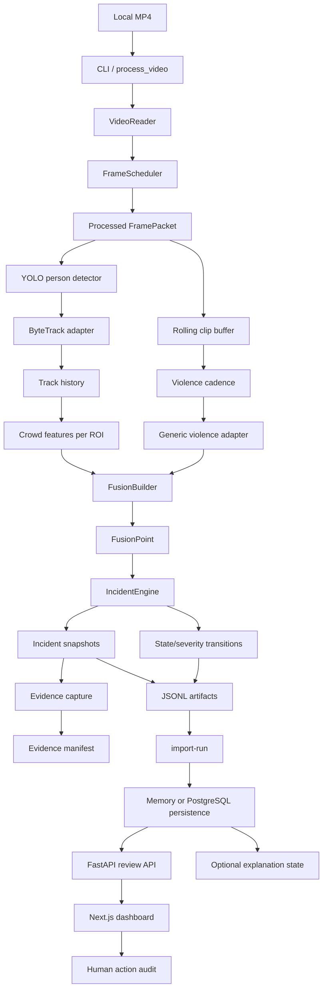

# Implementation Walkthrough

## 1. Two-Minute Summary

This repository implements a local, human-in-the-loop crowd-safety monitoring prototype. A recorded video is decoded deterministically, sampled at a configured rate, optionally resized and annotated, passed through person detection and temporary tracking, converted into interpretable crowd-motion features, paired with rolling temporal violence evidence, and fused into one evolving incident per source/ROI.

Milestones M1 through M5 are implemented:

- M1 provides the offline video runner, timestamp/frame scheduling, configuration loading, annotations, run metadata, JSONL artifacts, and benchmark metrics.
- M2 adds a replaceable YOLO26 person detector, ByteTrack adapter, source-local tracks, ROI-aware crowd features, and explicit perception health.
- M3A adds a rolling clip buffer and generic VideoMAE-style violence adapter with available/degraded/unavailable semantics. M3B transfer learning is intentionally deferred.
- M4 adds timestamp/ROI alignment, normalization, smoothing, weighted fusion strategies, persistence, severity, lifecycle transitions, deduplication, reason codes, and deterministic replay.
- M5 captures bounded evidence, imports immutable run records into memory or PostgreSQL, exposes a FastAPI review API, and provides a Next.js operator dashboard with audited actions and a separate explanation state.

The critical ownership boundary is deterministic: models emit signals, the fusion engine creates and updates incidents, persistence stores those authoritative records, and the UI renders them. Generated explanation text is supplementary and cannot create, close, escalate, or change severity. The system does not run live camera input, autonomous emergency dispatch, face recognition, demographic inference, cross-camera identity, or M3B/M6 evaluation yet.

The current implementation is an offline engineering and human-review prototype. It is not evidence of live readiness, calibrated accuracy, production authentication, or emergency-response integration.

## 2. Before and After

### Starting point: deterministic offline foundation

The first implementation was deliberately single-process and local. It established a stable source timestamp, frame index, target-FPS scheduler, resized output video, optional overlay, and structured run directory before adding model dependencies. That foundation remains the execution clock for all later stages.

### Current state: complete M1–M5 vertical slice

The runner now emits a chain of project-owned records:

```text
video
  -> frames.jsonl / annotated.mp4
  -> tracks.jsonl
  -> features.jsonl
  -> violence.jsonl
  -> fusion.jsonl
  -> incidents.jsonl / transitions.jsonl
  -> evidence manifest and media
  -> imported review records
  -> FastAPI
  -> Next.js operator review
```

The system no longer treats every positive inference window as an independent alert. Related evidence is accumulated into one deterministic incident keyed by source, ROI, and incident start time. Operators can inspect reason codes, signal timelines, evidence status, and append-only actions without mutating the machine-generated incident record.

## 3. End-to-End Runtime and Data Flow



### 3.1 Configuration and entry points

`src/crowd_safety/__main__.py` is the command-line boundary. It exposes:

- `validate-config` — parses and validates TOML without processing video.
- `process-video` — runs the complete offline pipeline and prints the run directory.
- `benchmark` — records processing success/failure, frame counts, timing, and effective FPS.
- `replay` — rebuilds fusion and incident outputs from stored crowd/violence signals without rerunning models.
- `import-run` — imports an offline run into configured PostgreSQL storage.
- `serve-api` — starts FastAPI using PostgreSQL or an explicit local-only in-memory mode.

`start.backend.sh` starts the API from the repository root. If `DATABASE_URL` is absent, it deliberately selects the ephemeral backend and prints that choice. `start.frontend.sh` starts the Next.js development server on port 3000 and points it at the local API unless `NEXT_PUBLIC_API_BASE_URL` is overridden.

The checked-in development configuration is `configs/pipeline/dev.toml`. Relative paths are resolved relative to the TOML file, so the configured input, output, model, and evidence paths are reproducible rather than dependent on the caller’s current directory.

### 3.2 Video read, scheduling, and write

`VideoReader` in `video.py` opens an OpenCV-compatible local video and emits `FramePacket` objects containing source ID, frame index, timestamp, and image. It rejects unreadable inputs and preserves monotonic source timestamps. `VideoWriter` writes resized frames to the run’s `annotated.mp4` and can be used with or without operational annotation.

`FrameScheduler` in `scheduling.py` selects deterministic source-frame slots for the configured target FPS. It keeps the first frame, rejects invalid/non-monotonic timestamps, avoids duplicate scheduling, and reports processed/skipped indices. The scheduler is tested independently so later model stages do not redefine the pipeline clock.

### 3.3 Person detection and tracking

`detection.py` defines the project-owned `PersonDetector` protocol and `DetectionResult`. `UltralyticsPersonDetector` loads the configured YOLO checkpoint, filters results to the configured person class, converts boxes into `PersonDetection` records, records latency, and reports model/device/checkpoint metadata. Vendor result objects stop at this adapter boundary.

`tracking.py` defines the `Tracker` protocol and `ByteTrackTracker`. It uses the configured `bytetrack.yaml` and track buffer when the Ultralytics dependency is available. Its output is a project-owned `TrackingResult` containing source-local `TrackObservation` records with temporary IDs, timestamps, boxes, centers, and confidence. Missing dependencies, model failures, and unavailable tracker state are explicit health outcomes rather than empty normal detections.

The runner scales detector boxes back to the resized output coordinate system before tracking/annotation where required. Overlay output can show person boxes, temporary track IDs, and short track trails. No cross-camera identity is created or persisted.

### 3.4 Crowd features

`crowd_features.py` consumes track histories and ROI polygons, not detector-specific objects. For every configured ROI and timestamp it derives:

- occupancy, represented by the current number of tracks in the ROI;
- `density_proxy`, occupancy divided by ROI pixel area;
- density change relative to the latest pre-window occupancy;
- mean speed, acceleration proxy, and speed variance using elapsed timestamps;
- direction disorder from the resultant length of unit motion vectors;
- convergence and dispersal fractions relative to the ROI centroid;
- counter-flow from opposing directional groups;
- congestion when occupancy is high and mean speed is below the configured threshold.

These are pixel/time proxies. They are not physical people-per-square-metre density without camera calibration. Short history, expired tracks, empty ROIs, and unavailable perception retain explicit `insufficient` or `unavailable` health rather than fabricated zero movement.

### 3.5 Rolling violence evidence

`violence.py` owns the temporal video branch:

- `RollingClipBuffer` retains packets for the configured clip duration and samples a fixed number of unique timestamps.
- `ViolenceCadence` prevents duplicate inference timestamps and runs inference at the configured interval.
- `ViolenceClassifier` is the model-independent adapter contract.
- `VideoMAEViolenceClassifier` loads the configured checkpoint/revision, validates the label mapping, converts sampled frames, and emits only the generic unsafe probability plus provenance.

The development configuration uses the approved fallback checkpoint `Nikeytas/videomae-crime-detector-fixed-format` at a pinned revision. The earlier `mitegvg` candidate was rejected during preflight and is retained only as documented context. The fallback model’s reported metrics are not treated as project results.

An unavailable model is not equivalent to `score = 0`. A failed model load is `unavailable`; an inference error after a usable model is loaded is `degraded`; a valid result is `available`. When no valid score exists, the score remains `null`, and the evidence retains model/checkpoint/label/status information.

### 3.6 Temporal fusion

`fusion.py` is the main project-specific research boundary. `FusionBuilder` associates crowd records and violence evidence only within the configured source/ROI policy and timestamp rules:

- evidence must have ended by the crowd timestamp;
- evidence must still be within `violence_stale_after_s`;
- evidence from another source is rejected;
- global evidence with a null region may apply to configured ROIs from the same source;
- named evidence applies only to its matching ROI.

Crowd values are normalized against explicit TOML bounds and clamped to the risk range. The temporal strategy can apply configured smoothing, weighted violence/density/movement/context/persistence components, and explicit missing-signal policy. Reason codes remain attached to every fusion point.

The same stored signal stream can be run through five strategies:

1. `violence-only`
2. `crowd-only`
3. `naive-or`
4. `rule-fusion`
5. `temporal`

The first four are comparison baselines or simpler policies. The proposed temporal path adds the configured smoothing, persistence, and lifecycle semantics. The violence threshold recorded in configuration does not itself create incidents.

### 3.7 Incident lifecycle and deduplication

`incidents.py` owns state, severity, deduplication, and transitions. `IncidentEngine` maintains one open incident per source/ROI key and transitions through:

```text
candidate -> active -> escalating -> critical
                         |             |
                         v             v
                      resolving -> closed
```

The exact path depends on risk, persistence, hysteresis, decay, and quiet-period configuration. A brief one-frame spike can create at most a candidate and then decay. A persistent signal activates the incident. Falling below the hysteresis boundary enters resolution, and closure requires the configured quiet period. A later event after closure receives a new deterministic start-time-based ID.

Incident snapshots preserve source/ROI, state, severity, start/update/close times, peak risk, and accumulated reason codes. `IncidentTransition` records preserve ordered state/severity changes and their causes. `flush()` closes out pending state at end of stream so end-of-stream behavior is not lost.

### 3.8 Evidence capture and review import

After the runner closes the M4 artifacts, `evidence.py` reads the generated timestamps and annotated video, selects bounded pre/post windows, writes a snapshot and clips when possible, and emits an `EvidenceManifest`. Every artifact has a status and provenance; a failed clip does not delete or invalidate the incident. Retention prunes only positively identified old run directories beneath the configured evidence root.

`persistence.py` imports the authoritative run bundle. It stores source/run metadata, incident snapshots, ordered transitions, filtered timelines, evidence manifests, explanation state, and operator actions. It removes source input paths from public API responses and rejects secret-like metadata keys before persistence.

The project has two persistence implementations behind one `Persistence` protocol:

- `MemoryPersistence` for tests and the explicit local `serve-api --ephemeral` demo.
- `PostgresPersistence` for durable review records using the packaged SQL migration.

Imports are idempotent. Reimporting the same deterministic run returns no-op behavior; changing authoritative content for an existing run raises `PersistenceConflict` instead of overwriting it. Database record IDs are run-scoped so identical source-local incident IDs from separate runs cannot collide.

### 3.9 API and explanation boundary

`api.py` creates the FastAPI app and exposes:

- health, source, and run read endpoints;
- incident list/detail endpoints with source/state filtering and a limit;
- incident timeline and evidence metadata endpoints;
- safe referenced-media serving for snapshots and pre/post clips;
- explanation read/generate endpoints;
- acknowledge, dismiss, and escalate action endpoints.

The evidence media route resolves the configured evidence root and rejects paths that escape it. The API deliberately strips the private input path from public run responses.

`explanations.py` defines `IncidentExplainer` plus disabled, unavailable, fake, and failure-tolerant implementations. Explanation generation runs only after an incident already exists. Its result is stored under a separate explanation record and is not consumed by fusion, lifecycle, severity, or operator action logic. In the development configuration the provider is disabled. `escalate` is an internal human request recorded in audit history; it never contacts emergency services.

### 3.10 Dashboard

The Next.js app is a small review console rather than a second decision engine:

- `frontend/app/incidents/page.js` loads health, sources, runs, and recent incidents and renders the authoritative incident list.
- `frontend/app/incidents/[id]/page.js` renders deterministic reason codes, signal timeline, state/severity, evidence media/status, stage health, audit history, and separately labelled explanation state.
- `frontend/components/DispositionControls.js` submits acknowledge, dismiss, and escalate actions with actor, timestamp, and optional note.
- `frontend/components/view-model.mjs` centralizes loading, empty, error, ready, deterministic-reason, and explanation-state modeling; its Node tests protect those UI contracts.
- `frontend/lib/api.js` provides no-store API calls and URL encoding.
- `loading.js`, `error.js`, and page-level catch paths provide loading and connection-failure states.

The UI states plainly that deterministic reasons are authoritative and generated text is supplementary. It does not infer incident state or severity from raw display values.

## 4. Code Map

### Runtime and domain

- `src/crowd_safety/__main__.py` — CLI command routing.
- `src/crowd_safety/config.py` — typed configuration records, path resolution, validation, and M1–M5 defaults.
- `src/crowd_safety/types.py` — project-owned records: frames, health, detections, tracks, crowd features, violence evidence, fusion points, incidents, evidence, explanations, and operator actions.
- `src/crowd_safety/video.py` — OpenCV reader/writer boundaries.
- `src/crowd_safety/scheduling.py` — deterministic timestamp scheduling.
- `src/crowd_safety/artifacts.py` — resolved configuration, SHA-256 config hashing, and JSON writing.
- `src/crowd_safety/runner.py` — orchestration and artifact production for the complete offline path.

### Perception and reasoning

- `src/crowd_safety/detection.py` — YOLO adapter and detector health/provenance.
- `src/crowd_safety/tracking.py` — ByteTrack adapter and project-owned observations.
- `src/crowd_safety/crowd_features.py` — pure ROI/trajectory feature calculations.
- `src/crowd_safety/violence.py` — rolling clip buffer, cadence, and temporal classifier adapter.
- `src/crowd_safety/fusion.py` — source/ROI association, normalization, smoothing, strategies, and reason codes.
- `src/crowd_safety/incidents.py` — lifecycle, severity, hysteresis, persistence, deduplication, flush, and replay state.
- `src/crowd_safety/replay.py` — reconstruction from stored feature/violence JSONL.
- `src/crowd_safety/annotations.py` — operational overlays for ROI, boxes, tracks, crowd status, and violence status.

### Product layer

- `src/crowd_safety/evidence.py` — bounded snapshot/video capture and retention.
- `src/crowd_safety/persistence.py` — import contract, in-memory store, PostgreSQL store, idempotency, conflict detection, and public-record assembly.
- `src/crowd_safety/migrations/001_m5.sql` — tables for sources, runs, incidents, transitions, timelines, evidence, explanations, and actions.
- `src/crowd_safety/api.py` — FastAPI review boundary and safe media serving.
- `src/crowd_safety/explanations.py` — non-authoritative explanation state.
- `frontend/` — Next.js review console and UI state tests.

### Supporting data preparation

- `colab-notebooks/dataset_download.ipynb` — Colab workflow for authorised dataset download/import, selected frame-to-video conversion, reproducible train/validation/evaluation splits, and temporary-file cleanup. It is not part of the production runtime. Large/private media remain external.

### Configuration and dependencies

- `configs/pipeline/dev.toml` — development processing, model, ROI, fusion, evidence, database, and explanation settings.
- `pyproject.toml` — Python package and pinned core/M2/M5 dependencies, with `transformers` isolated in the `violence` extra.
- `start.backend.sh` and `start.frontend.sh` — local development startup wrappers.

## 5. Core Contracts and Artifact Layout

### Domain contract rules

`types.py` is intentionally vendor-independent. Important invariants include:

- `FramePacket` carries the pipeline clock.
- `StageHealth` accepts only known statuses and records stage/detail/latency where applicable.
- `PersonDetection` and `TrackObservation` validate geometry and confidence.
- Crowd records can represent `insufficient` or `unavailable` health without pretending movement was zero.
- Violence evidence requires a score when available and keeps null scores for unavailable/degraded inference.
- M5 records reject unsafe paths and secret-like metadata.
- Explanation and operator-action records are separate from deterministic incident state.

### Run directory

Each run is written below the configured output directory using a generated run ID. The important files are:

```text
artifacts/<run-id>/
├── annotated.mp4
├── frames.jsonl
├── tracks.jsonl             # when perception/tracking is enabled
├── features.jsonl           # one row per timestamp/ROI
├── violence.jsonl           # rolling temporal evidence
├── fusion.jsonl             # aligned signal and risk points
├── incidents.jsonl          # final incident snapshots
├── transitions.jsonl        # ordered lifecycle/severity transitions
├── config.json              # resolved config and hash
├── metadata.json             # run/source/artifact metadata
└── metrics.json              # counts, health, latency, and effective FPS
```

M5 evidence is stored beneath the configured evidence root, not committed to Git:

```text
artifacts/evidence/<run-id>/<incident-id>/
├── snapshot.jpg
├── pre_event.mp4
├── post_event.mp4
└── manifest.json
```

The manifest can represent unavailable or failed artifacts explicitly. Persistence stores references and metadata; it does not copy raw media into PostgreSQL JSON payloads.

### Migration and record ownership

`001_m5.sql` creates:

- `m5_sources` and `m5_runs` for source/run provenance;
- `m5_incidents` for authoritative incident snapshots;
- `m5_transitions` for ordered state history;
- `m5_timelines` for incident-scoped fusion points;
- `m5_evidence` for capture manifests;
- `m5_explanations` for separate generated/disabled/unavailable state;
- `m5_actions` for append-only acknowledge/dismiss/escalate records.

M4 remains the source of truth for incident state and severity. M5 import/API code does not recalculate M4 decisions.

## 6. Important Design Decisions

### Offline first

The system uses one deterministic local process before queues, workers, live inputs, or distributed infrastructure. This keeps timing, replay, debugging, and test fixtures tractable. The tradeoff is that the current runner is not a live multi-camera service.

### Adapter boundaries

Detector, tracker, violence classifier, persistence, and explainer are protocols or explicit adapters. Vendor-specific result objects and model tensors do not leak into crowd features, fusion, or the UI. The tradeoff is a small amount of conversion code in exchange for testable fake adapters and replaceable models.

### Explicit missing-signal semantics

`unavailable` or stale violence is not silently converted into a safe score. This prevents a failed model branch from lowering risk as if it had observed benign video. The tradeoff is that downstream fusion must handle null values and degraded policy explicitly.

### Rule-first temporal fusion

Deterministic normalization, weighted components, persistence, hysteresis, lifecycle, and reason codes are implemented before learned fusion. This keeps the research contribution inspectable and allows violence-only, crowd-only, naive-OR, and rule-fusion comparisons on the same stored stream. The tradeoff is that thresholds and weights require calibration in M6.

### Evidence and explanation separation

Evidence capture occurs after deterministic incident creation. VLM explanation is an optional downstream annotation. The UI presents machine reasons and generated text in separate sections. This preserves an authoritative incident path even when media capture or an external explanation provider fails.

### Scoped local prototype security

The API removes source input paths from public responses, restricts evidence media to configured-root references, validates action payloads, limits CORS to local dashboard origins, rejects secret-like persisted metadata, and keeps the database DSN environment-configured. The current prototype does not have an authentication/principal contract; operator actor fields are client-supplied and must not be treated as production identity.

## 7. Failure and Recovery Paths

- Invalid TOML, non-finite numbers, invalid ROI geometry, unordered thresholds, invalid model labels, and invalid M5 settings fail during configuration validation.
- Unreadable video fails at the `VideoReader` boundary rather than emitting fabricated frames.
- A missing detector/tracker dependency produces explicit unavailable health and keeps the run structurally inspectable where the configured path permits it.
- A model-load failure is unavailable; an inference failure after load is degraded; neither is written as normal zero-risk violence.
- Short track history produces insufficient features. Insufficient crowd evidence does not create a positive incident.
- Violence evidence is aligned only when temporal and source/ROI constraints pass. Stale evidence retains raw provenance but has no effective violence score.
- A one-frame risk spike cannot activate a persistent incident without configured persistence.
- Active incidents resolve only after hysteresis/quiet-period rules. Repeated windows update one incident rather than creating duplicates.
- End-of-stream flushing preserves pending incident state and transitions.
- Evidence capture can fail independently. The manifest records the failure while the incident remains available.
- PostgreSQL import is transactional. A failed insert rolls back; an identical reimport is a no-op; a changed authoritative bundle raises `PersistenceConflict`.
- API reads return 404 for missing records or unreferenced/unavailable media. Media path traversal is rejected.
- Explanation timeout/failure is stored as unavailable/failed state and does not alter the incident.
- Frontend API failures render a connection/unavailable state; empty data renders an explicit no-incidents state; action failures remain visible to the operator.

## 8. Frontend Behavior

The dashboard is a server-rendered Next.js review surface with a small client-side action component.

The incident list fetches health, source, run, and incident data together. It shows source/ROI, state, severity, peak fused risk, reason codes, evidence availability, input mode, and explanation availability. It labels records as detected indicators rather than guaranteed predictions.

The incident detail page separates:

1. deterministic reason codes and signal timeline;
2. human disposition and append-only audit history;
3. captured snapshot/pre/post evidence and stage health;
4. separately labelled AI-generated explanation status/text.

The disposition component disables buttons during submission, requires a non-empty actor, accepts an optional note, reports success/failure, and reloads the authoritative record after a successful action. The escalation copy explicitly says the action is an internal human request and does not contact emergency services.

The frontend unit tests cover loading, empty, error, ready, deterministic-reason, and explanation-state modeling. The recorded frontend verification included `npm test`, `npm run lint`, and `npm run build`; native browser screenshots, responsive viewport checks, and console/network inspection remain unverified in the available environment.

## 9. Configuration and Operational Behavior

The development TOML makes the experimental surface explicit:

- resize and target FPS;
- detector model, class, confidence, cadence, device;
- tracker config and buffer;
- crowd window/history/speed/congestion thresholds and ROI polygon;
- violence checkpoint, revision, labels, clip duration, sample count, cadence, threshold, device, license, limitations, and hash;
- fusion strategy, normalization bounds, weights, thresholds, persistence, smoothing, stale interval, hysteresis, decay, quiet period, severity boundaries, and degraded-mode policy;
- evidence root, pre/post durations, retention, database environment variable, and explanation provider state.

`resolved_config()` serializes these values, `config_hash()` stores a stable SHA-256, and replay rejects a changed resolved configuration rather than silently producing incomparable results. The fusion version is also recorded.

The Python package pins the core OpenCV, Ultralytics, LAP, FastAPI, psycopg, and Uvicorn versions. The violence transformer dependency is optional so core tests can run without the model stack. Generated artifacts, environments, raw media, and model files are intended to remain ignored/external.

## 10. Verification Evidence

The recorded repository verification evidence is:

- `venv/bin/python -m unittest discover -s tests -v` — 90 Python tests passed in the M5 verification record.
- Focused M1–M4 suites covering configuration, types, scheduler, video I/O, detection, tracking, crowd features, violence buffering, fusion, incidents, runner, CLI, and replay passed in the recorded milestone checks.
- M5 suites cover evidence bounds/failure/retention, persistence idempotency/conflict/order, API filtering/media/actions, explanation isolation, and a video-to-review flow.
- `venv/bin/python -m compileall -q src` — passed.
- `venv/bin/python -m crowd_safety validate-config --config configs/pipeline/dev.toml` — passed.
- `git diff --check` — passed in the recorded implementation checks.
- Fake-adapter integration emitted tracks, features, violence, fusion, incidents, transitions, evidence, and review records without requiring GPU, network, model credentials, or PostgreSQL for the core path.
- Replay generated all five strategy outputs from stored signals and rejected incompatible changed configuration.
- Disposable PostgreSQL integration verified first import, idempotent reimport, ordered timeline/transitions, and append-only action persistence.
- Local HTTP checks returned 200 for API health, incident list/detail, and dashboard routes. Native browser visual QA was unavailable.
- Offline local-video evidence was recorded for `fighting1.mp4` and `walking.mp4`, including playable annotated output, track/feature counts, effective FPS, and explicit insufficient/success health. These are engineering observations, not labeled accuracy or live-readiness claims.

The remaining evidence gap is important: there is no checked-in labeled evaluation manifest, no M6 event/operational metric report, no live input test, no production deployment test, no authenticated operator test, and no native-browser visual QA result.

## 11. Risks, Assumptions, and Deferred Work

### Known risks

- Fragmented detections can produce insufficient track histories, especially in dense or abnormal scenes.
- Development normalization bounds and thresholds are not calibrated accuracy claims.
- The fallback violence model may not generalize across cameras, lighting, compression, or benign high-motion footage.
- Evidence clips can consume disk space; retention is currently local and configuration-driven.
- The API is a local prototype without authenticated principal binding.
- The current client-supplied actor field is audit metadata, not a security identity.
- The Colab notebook contains an existing hard-coded SharePoint session cookie and must not be shared as-is; credentials should be rotated/removed in a separate security change.

### Assumptions

- Processed frame timestamps are the alignment clock for crowd and violence evidence.
- Evidence ending at a crowd timestamp is eligible for that point.
- ROI names are source-local association boundaries.
- Temporary track IDs are source-local and are not identity claims.
- PostgreSQL JSON payloads plus ordered child rows are sufficient for this prototype until production schema needs are measured.
- Human review remains required before any external escalation.

### Intentionally deferred

- M3B X3D-S transfer learning and comparison.
- M6A/M6B curated evaluation, event matching, false-alert rate, detection delay, duplicate-alert metrics, and failure analysis.
- Live webcam/RTSP ingestion.
- Queue/worker/distributed execution.
- Production authentication and authorization.
- Real VLM provider integration and credential/privacy approval.
- Autonomous emergency dispatch.
- Face recognition, demographic inference, persistent cross-camera identity, audio analysis, and opaque end-to-end stampede classification.

## 12. Must-Read Code Before Production

1. `src/crowd_safety/runner.py:process_video` — verify stage ordering, evidence alignment, end-of-stream flushing, artifact closure, and health propagation.
2. `src/crowd_safety/fusion.py:FusionBuilder.add` — verify stale evidence, source/ROI association, normalization, smoothing, and degraded-mode policy.
3. `src/crowd_safety/incidents.py:IncidentEngine.update` and `flush` — verify persistence, hysteresis, closure, deterministic IDs, and transition ordering.
4. `src/crowd_safety/config.py:load_config` — verify every production threshold, path, model revision, and validation rule.
5. `src/crowd_safety/persistence.py:import_run` and `PostgresPersistence.import_bundle` — verify immutable import, conflict behavior, transaction rollback, and record scoping.
6. `src/crowd_safety/api.py:create_app` — add/verify authentication before exposing action endpoints beyond localhost and recheck media-root safety.
7. `src/crowd_safety/evidence.py:capture_run_evidence` — inspect clip bounds, retention behavior, and failure manifests before increasing media retention.
8. `frontend/app/incidents/[id]/page.js` and `frontend/components/DispositionControls.js` — inspect the human review surface and ensure UI actions remain subordinate to API/domain state.

## 13. Questions the Owner Should Be Able to Answer

1. Which component owns incident creation, and why cannot a detector or explanation provider create one directly?
2. What is the difference between an unavailable violence model, a stale violence result, and a valid low violence score?
3. Which configuration values control candidate activation, escalation, hysteresis, and closure?
4. How does replay guarantee that the same stored signal stream produces the same incident IDs and transition ordering?
5. What happens if evidence capture fails after the incident engine has created an incident?
6. How does PostgreSQL import prevent an identical run from being duplicated or a changed run from overwriting authoritative records?
7. Which API/UI controls are still unsafe for production because there is no authenticated principal contract?
8. Which claims remain unproven until M6 evaluation and live/browser/deployment validation are completed?

## 14. M6 Evaluation and Demo Hardening

The M6 increment adds `colab-notebooks/m6_evaluation_demo.ipynb` and versioned contracts under `evaluation/`. The notebook mounts Drive when running in Colab, resolves only relative media paths beneath `CROWD_SAFETY_DATA_ROOT`, runs `process_video` once per selected entry, and calls the existing replay implementation for `violence-only`, `crowd-only`, `naive-or`, `rule-fusion`, and `temporal` outputs.

The manifest fixture represents no-event, single-event, and multiple-event cases without committing footage. Its validator rejects duplicate IDs, invalid intervals, unsupported labels, source/session split leakage, absolute paths, and traversal paths. It retains the logical manifest source ID for matching and records the runner's observed source ID separately because the current local-file reader uses its fixed source identifier.

The matcher treats a first `active` transition as an actionable alert, matches events one-to-one using configured temporal overlap/tolerance and source/ROI constraints, and reports precision/recall/F1, false alerts per camera-hour, duplicate alerts per true event, detection delay, duration error, evidence completeness, scenario/tag failure slices, and saved stage latency. The report writes `config.json`, `environment.json`, `manifest.json`, `predictions.jsonl`, `incidents.jsonl`, `metrics.json`, `model_predictions.jsonl`, `vlm_reviews.jsonl`, and `summary.md` beneath an external evaluation run directory.

M3A predictions are aggregated from saved violence evidence. A compatible M3B export is accepted only through the versioned prediction contract; absent or incompatible M3B input is reported as pending. VLM review records are separate from incident/model metrics, and the default disabled record keeps the deterministic incident workflow valid. The optional review helper imports the source run into existing `MemoryPersistence`, starts the existing FastAPI app through `TestClient`, and records an acknowledge action.

### M6 verification

- Notebook JSON/code-cell compilation and all assert-based self-checks passed locally.
- A generated short-video integration with fake adapters produced one source run, all five replay directories, a matched temporal alert, report artifacts, latency data, disabled-VLM output, and pending-M3B wording.
- `venv/bin/python -m unittest` passed: 90 tests.
- `frontend/npm test` passed: 2 tests.
- `frontend/npm run build` passed; it retains the pre-existing `no-img-element` warning in `frontend/app/incidents/[id]/page.js`.

The curated Drive/Colab run, representative overlay/evidence inspection, live dashboard disposition, and M3B comparison remain external follow-up work because authorised evaluation media and a compatible M3B held-out export are not present in this workspace. No curated accuracy or live-readiness claim is made.
